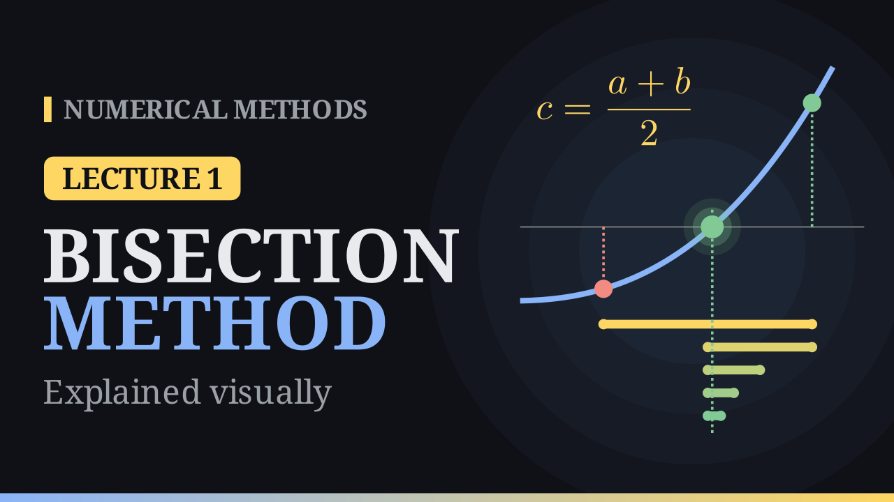
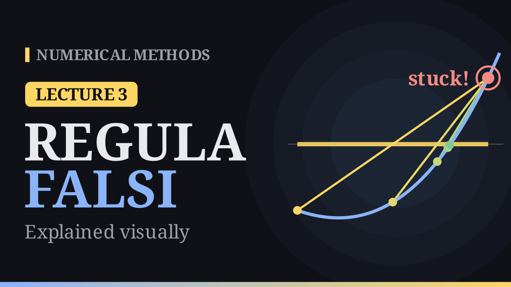
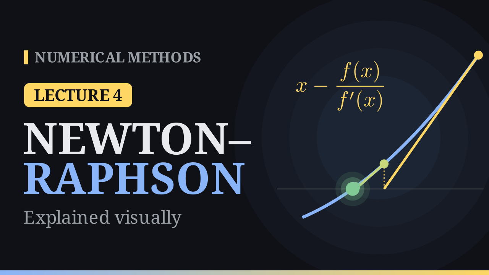

  
A visual course

  <h1>Numerical Methods</h1>
  
Short animated lectures on the algorithms behind scientific computing. Each lecture comes with notes and a self-paced practice page with live plots, hints and instant feedback.

  

    <a class="md-button md-button--primary" href="lectures/lec01-bisection/">Start with Lecture 1</a>
  

## Lectures

  <article class="nm-lecture">
    
    

      
Lecture 1 · 7 min

      <h3><a href="lectures/lec01-bisection/">The Bisection Method</a></h3>
      
Bracket a root, cut the interval in half and keep the half with the sign change. Slow, but guaranteed: \(|c_n - r| \le \frac{b-a}{2^n}\).

      

        <a href="lectures/lec01-bisection/">Notes</a>
        <a href="https://www.youtube.com/watch?v=OyOAFWVk5Sc">Video</a>
        <a href="practice/lec01_bisection.html">Practice</a>
      

    

  </article>
  <article class="nm-lecture">
    
    

      
Lecture 2 · 8 min

      <h3><a href="lectures/lec02-secant/">The Secant Method</a></h3>
      
Replace the curve by the straight line through the last two points. Much faster than bisection, with order \(p = \frac{1+\sqrt5}{2} \approx 1.618\).

      

        <a href="lectures/lec02-secant/">Notes</a>
        <a href="https://www.youtube.com/watch?v=4c2-SlNsi70">Video</a>
        <a href="practice/lec02_secant.html">Practice</a>
      

    

  </article>
  <article class="nm-lecture">
    
    

      
Lecture 3 · 8 min

      <h3><a href="lectures/lec03-regula-falsi/">Regula Falsi</a></h3>
      
Bisection's bracket with the secant's straight line. Safe, but an endpoint can get stuck, until the Illinois fix makes it superlinear.

      

        <a href="lectures/lec03-regula-falsi/">Notes</a>
        <a href="https://www.youtube.com/watch?v=mJpxcbBGdI4">Video</a>
        <a href="practice/lec03_regula_falsi.html">Practice</a>
      

    

  </article>
  <article class="nm-lecture">
    
    

      
Lecture 4 · 8 min

      <h3><a href="lectures/lec04-newton/">The Newton–Raphson Method</a></h3>
      
Follow the tangent line down to the axis. Quadratic convergence, \(e_{n+1} \approx C\,e_n^2\): the correct digits double every step.

      

        <a href="lectures/lec04-newton/">Notes</a>
        <a href="https://www.youtube.com/watch?v=MIM5zopwb5o">Video</a>
        <a href="practice/lec04_newton.html">Practice</a>
      

    

  </article>
  <article class="nm-lecture nm-soon">
    

Coming next
Fixed-point iteration · Order of convergence · Floating-point numbers

  </article>

## How each lecture works

  
<b>Watch</b>A 6–8 minute animated video that builds the idea step by step.

  
<b>Read</b>The notes: key formulas, the worked example and the algorithm.

  
<b>Practise</b>Nine short interactive tasks. Your progress is saved as you go.

