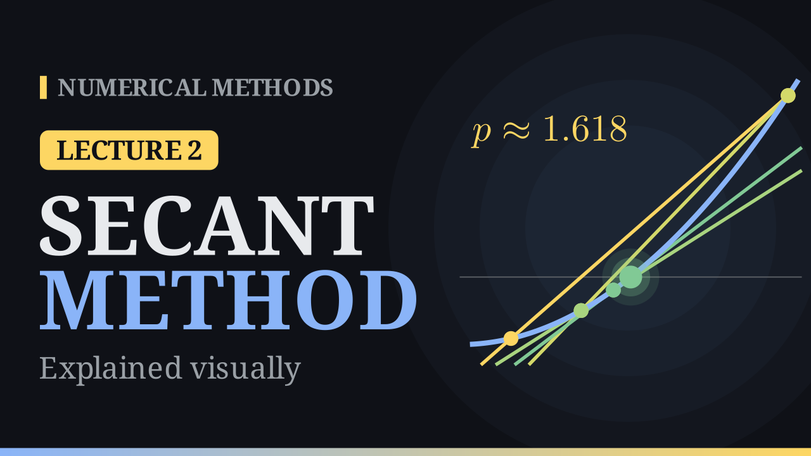

# Lecture 2 · The Secant Method

{ .nm-thumb }

<div class="nm-actions" markdown>
[:material-pencil-box-outline: Practise this lecture](../practice/lec02_secant.html){ .md-button .md-button--primary }
</div>

## The idea

Bisection only uses the **signs** of \(f\). The secant method uses the **values**: up close, a smooth curve looks like a straight line, so replace the curve by the line through the last two points and see where that line crosses the axis.

## The secant formula

The line through \((x_0, f(x_0))\) and \((x_1, f(x_1))\) crosses the axis at

\[
x_2 = x_1 - \frac{f(x_1)\,(x_1 - x_0)}{f(x_1) - f(x_0)} .
\]

Repeat, keeping the two newest points:

\[
x_{n+1} = x_n - \frac{f(x_n)\,(x_n - x_{n-1})}{f(x_n) - f(x_{n-1})}, \qquad n \ge 1 .
\]

## Worked example

\(f(x) = x^3 + 2x^2 - x - 1\) with \(x_0 = 0\), \(x_1 = 1\). The root in \([0,1]\) is \(r = 0.8019377\ldots\)

| \(n\) | \(x_n\) | \(f(x_n)\) | \(\lvert x_n - r\rvert\) |
|---:|---:|---:|---:|
| 0 | 0 | −1 | 8.0e−1 |
| 1 | 1 | +1 | 2.0e−1 |
| 2 | 0.5 | −0.875 | 3.0e−1 |
| 3 | 0.7333333 | −0.2634 | 6.9e−2 |
| 4 | 0.8338279 | +0.1364 | 3.2e−2 |
| 5 | 0.7995353 | −0.0099 | 2.4e−3 |
| 6 | 0.8018581 | −0.00033 | 8.0e−5 |
| 7 | 0.8019379 | +8.4e−7 | 2.0e−7 |
| 8 | 0.8019377 | ≈ 0 | 1.7e−11 |

Notice \(x_2\) and \(x_3\) are both **below** the axis: unlike bisection, the secant method does not keep a bracket. The line simply extends beyond the two points.

## Why it is fast: the golden ratio

For the secant method

\[
e_{n+1} \approx C\, e_n\, e_{n-1}, \qquad C \approx \left|\frac{f''(r)}{2 f'(r)}\right| .
\]

Multiplying errors **adds** their numbers of correct digits, so the digits grow like the Fibonacci numbers. In the example: 1.5, 2.6, 4.1, 6.7, 10.8. The ratio of consecutive Fibonacci numbers tends to the golden ratio, which gives the order of convergence

\[
p^2 = p + 1 \quad\Longrightarrow\quad p = \frac{1+\sqrt5}{2} \approx 1.618 \quad (\text{superlinear}).
\]

## When it fails

- **Flat curve:** if \(f(x_n) \approx f(x_{n-1})\) the line is nearly horizontal and the next guess shoots far away (from \(x_0 = 0.2\), \(x_1 = 0.3\) the example jumps to \(x_2 \approx 6.05\)); if they are equal, we divide by zero.
- **No bracket:** convergence is only local. From \(-1.5\) and \(-1\) the method converges, but to a different root, \(-0.555\).

## Algorithm

```text
input  f, x0, x1, tol, maxit
for k = 1 to maxit
    if  f(x1) = f(x0):  error (zero denominator)
    x2 ← x1 − f(x1)·(x1 − x0) / (f(x1) − f(x0))
    x0 ← x1
    x1 ← x2
    if  |x1 − x0| < tol:  return x1
end
```

## Bisection vs secant

| | Bisection | Secant |
|---|---|---|
| Always converges? | yes | no |
| Order \(p\) | 1 (linear) | 1.618 (superlinear) |
| Needs a bracket? | yes | no |
| Derivatives? | no | no |
| New \(f\)-values per step | 1 | 1 |

In practice the two ideas are combined: MATLAB's `fzero` keeps a bracket like bisection but takes fast secant-like steps when it is safe.

[:material-pencil-box-outline: Practise this lecture](../practice/lec02_secant.html){ .md-button .md-button--primary }
