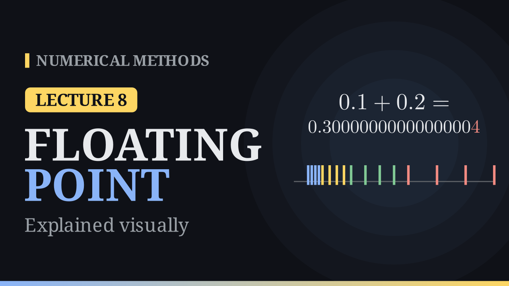

Lecture 8

# Errors and Floating-Point Numbers

{ .nm-video }

[Practise this lecture](../practice/lec08_floating_point.html){ .md-button .md-button--primary }

#### Key results
- Relative error \(\dfrac{|x - x^*|}{|x|}\); \(x^*\) has \(t\) significant digits if it is at most \(5\times10^{-t}\).
- Floating point: \(x = \pm\,0.d_1d_2\ldots d_t\times\beta^e\), \(d_1 \ne 0\), \(L \le e \le U\). The numbers are unevenly spaced.
- \(\mathrm{fl}(x) = x(1 + \varepsilon)\) with \(-\beta^{1-t} < \varepsilon \le 0\) (chopping) or \(|\varepsilon| \le \tfrac12\beta^{1-t}\) (rounding).

## Why it matters

On a computer \(0.1 + 0.2 = 0.30000000000000004\), because \(0.1\) has no finite binary expansion. In 1991 a Patriot missile battery counted time in tenths of a second, with \(0.1\) chopped to 23 binary digits after the point. Each tick lost about \(9.5\times10^{-8}\) s; after 100 hours (\(3.6\times10^6\) ticks) the clock was off by \(0.34\) s, enough for a Scud missile to travel more than half a kilometre.

## Sources of error

| Source | Example |
|---|---|
| Modelling | the equations idealise the real system |
| Data | measured inputs are not exact |
| Truncation | an infinite process is cut short, e.g. \(e^x \approx 1 + x + \frac{x^2}{2}\) |
| Round-off | only finitely many digits are kept |

**Truncation example.** At \(x = 0.1\), \(e^{0.1} - 1.105 = 1.71\times10^{-4}\), and Taylor's remainder bounds it by \(\frac{e^{0.1}}{3!}(0.1)^3 = 1.84\times10^{-4}\).

## Absolute and relative error

If \(x^*\) approximates \(x\): absolute error \(|x - x^*|\), relative error \(\dfrac{|x - x^*|}{|x|}\).

| \(x\) | \(x^*\) | absolute | relative |
|---:|---:|---:|---:|
| \(1\) | \(1.1\) | \(0.1\) | \(0.1\) |
| \(1000\) | \(1000.1\) | \(0.1\) | \(10^{-4}\) |

\(x^*\) has \(t\) **significant digits** if the relative error is at most \(5\times10^{-t}\). For \(x = \frac13\), \(x^* = 0.333\): relative error \(10^{-3} \le 5\times10^{-3}\), so \(3\) significant digits.

## Binary numbers

Integer part: divide by \(2\) and read the remainders upwards. Fractional part: multiply by \(2\) and read off the integer parts.

\[
13.375 = 1101.011_2, \qquad 0.1 = 0.0\overline{0011}_2 = 0.000110011\ldots_2 .
\]

A fraction has a finite binary expansion only if its denominator (in lowest terms) is a power of \(2\).

## Floating-point systems

A normalised floating-point number is

\[
x = \pm\,0.d_1 d_2 \ldots d_t \times \beta^{e}, \qquad d_1 \ne 0,\quad L \le e \le U .
\]

The system \(F(\beta, t, L, U)\) has largest number \(x_U = (1 - \beta^{-t})\beta^U\), smallest positive number \(x_L = \beta^{L-1}\), and \(2(\beta - 1)\beta^{t-1}(U - L + 1) + 1\) numbers.

**Toy system \(F(2, 3, -1, 2)\).** Mantissas \(0.100_2, 0.101_2, 0.110_2, 0.111_2 = 0.5, 0.625, 0.75, 0.875\):

| \(e\) | numbers | gap |
|---:|---|---:|
| \(-1\) | \(0.25,\ 0.3125,\ 0.375,\ 0.4375\) | \(\frac1{16}\) |
| \(0\) | \(0.5,\ 0.625,\ 0.75,\ 0.875\) | \(\frac18\) |
| \(1\) | \(1,\ 1.25,\ 1.5,\ 1.75\) | \(\frac14\) |
| \(2\) | \(2,\ 2.5,\ 3,\ 3.5\) | \(\frac12\) |

\(16\) positive, \(16\) negative and zero: \(33\) numbers, with \(x_L = \frac14\), \(x_U = \frac72\). The gap doubles with each exponent, but the gap relative to \(x\) stays about the same. Results beyond \(x_U\) **overflow**; nonzero results below \(x_L\) **underflow**.

## Chopping and rounding

Chopping drops the digits after the \(t\)-th; rounding takes the nearest floating-point number. With \(\beta = 10\), \(t = 4\):

| \(x\) | chopped | rounded |
|---|---|---|
| \(\pi = 0.314159\ldots\times10\) | \(0.3141\times10\) | \(0.3142\times10\) |
| \(\frac23\) | \(0.6666\) | \(0.6667\) |
| \(-0.0123449\) | \(-0.1234\times10^{-1}\) | \(-0.1234\times10^{-1}\) |
| \(99.996\) | \(0.9999\times10^{2}\) | \(0.1000\times10^{3}\) |

**Ties.** Computers round halfway cases to the neighbour with an even last digit (\(2.5 \to 2\), \(3.5 \to 4\)), so the errors do not drift in one direction.

## The relative error of fl(x)

\[
\mathrm{fl}(x) = x(1 + \varepsilon), \qquad
\begin{cases} -\beta^{1-t} < \varepsilon \le 0 & \text{chopping}\\[2pt] |\varepsilon| \le \tfrac12\beta^{1-t} & \text{rounding}\end{cases}
\]

*Proof.* With \(x = 0.d_1d_2\ldots\times\beta^e\), chopping changes \(x\) by less than one unit in the last place, \(\beta^{e-t}\), and \(|x| \ge 0.1_\beta\times\beta^e = \beta^{e-1}\) since \(d_1 \ne 0\). So the relative error is below \(\beta^{e-t}/\beta^{e-1} = \beta^{1-t}\). Rounding moves at most half as far. For \(\beta = 10\), \(t = 4\): \(10^{-3}\) (chopping) and \(5\times10^{-4}\) (rounding).

[Practise this lecture](../practice/lec08_floating_point.html){ .md-button .md-button--primary }
[← Previous: Order and Modified Newton](lec07-order-modified-newton.md){ .md-button }
[Next: Machine Epsilon →](lec09-rounding-errors.md){ .md-button }

