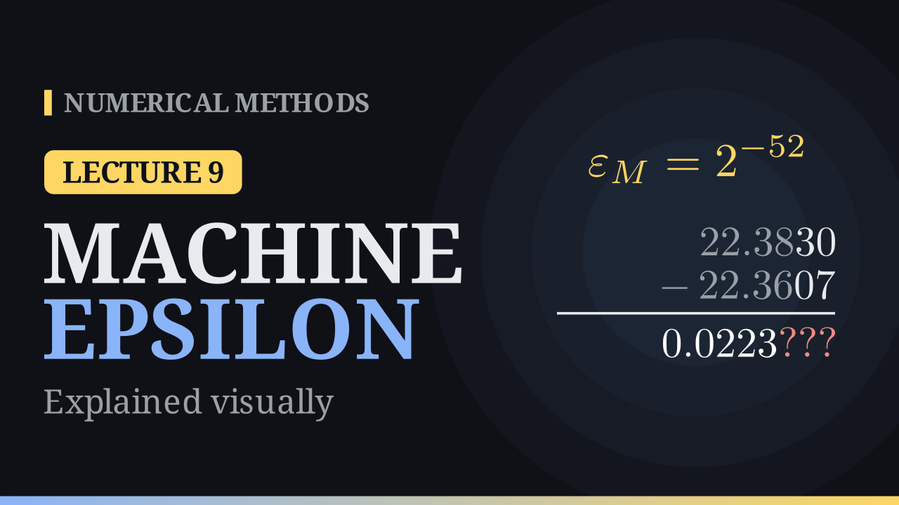

Lecture 9

# Machine Epsilon and Loss of Significance

{ .nm-video }

[Practise this lecture](../practice/lec09_rounding_errors.html){ .md-button .md-button--primary }

#### Key results
- Machine epsilon \(\varepsilon_M = \beta^{1-t}\), the gap between \(1\) and the next number; unit round-off \(u = \frac12\varepsilon_M\).
- Model of arithmetic: \(x \circledast y = (x * y)(1 + \delta)\), \(|\delta| \le u\).
- Products: relative errors add. Sums: amplified by \(\frac{|x| + |y|}{|x + y|}\), huge when \(x \approx -y\) (cancellation).
- IEEE double: \(\varepsilon_M = 2^{-52} \approx 2.22\times10^{-16}\), about \(16\) digits.

## Machine epsilon

\[
\varepsilon_M = \beta^{1-t}, \qquad u = \tfrac12\,\varepsilon_M .
\]

\(\varepsilon_M\) is the distance from \(1\) to the next floating-point number; \(u\) bounds the relative error of rounding. It can be found by halving: start with \(e = 1\) and halve while \(1 + e/2 > 1\). In double precision the loop stops at \(e = 2^{-52} \approx 2.22\times10^{-16}\), and \(1 + 2^{-53} = 1\).

## Floating-point arithmetic

Each operation is computed as if exactly and then rounded:

\[
x \circledast y = (x * y)(1 + \delta), \qquad |\delta| \le u, \quad * \in \{+, -, \times, \div\}.
\]

**Addition is not associative.** With \(4\) digits, \((1.000 + 0.0004) + 0.0004 = 1.000\) but \(1.000 + (0.0004 + 0.0004) = 1.001\) (exact: \(1.0008\)). Add small terms first.

## Propagation of errors

**Products and quotients** are safe:

\[
x(1+\varepsilon_1)\cdot y(1+\varepsilon_2) \approx xy\,(1 + \varepsilon_1 + \varepsilon_2), \qquad
\frac{x(1+\varepsilon_1)}{y(1+\varepsilon_2)} \approx \frac{x}{y}(1 + \varepsilon_1 - \varepsilon_2).
\]

**Sums** can amplify errors:

\[
x(1+\varepsilon_1) + y(1+\varepsilon_2) = (x+y)\Big(1 + \frac{x\varepsilon_1 + y\varepsilon_2}{x+y}\Big), \qquad
\text{relative error} \le \frac{|x| + |y|}{|x+y|}\,\max|\varepsilon_i| .
\]

When \(x \approx -y\) the factor is huge: **catastrophic cancellation**. The subtraction itself is exact; the errors already in \(x\) and \(y\) become the leading digits of the result.

## Example: \(\sqrt{x+1} - \sqrt{x}\) at \(x = 500\), 6 digits

| | value |
|---|---|
| \(\sqrt{501},\ \sqrt{500}\) | \(22.3830,\ 22.3607\) |
| direct: \(22.3830 - 22.3607\) | \(0.0223000\) (relative error \(2.2\times10^{-3}\)) |
| rationalised: \(\dfrac{1}{\sqrt{501} + \sqrt{500}} = \dfrac{1}{44.7437}\) | \(0.0223495\) (all digits correct) |

## Example: the quadratic formula

\(x^2 + 62.10x + 1 = 0\) with \(4\)-digit arithmetic: \(b^2 - 4 = 3852\), \(\sqrt{3852} = 62.06\).

| | computed | true |
|---|---:|---:|
| \(x_1 = \dfrac{-b + \sqrt{b^2 - 4ac}}{2a}\) | \(-0.02000\) | \(-0.01610724\) |
| \(x_1 = \dfrac{-2c}{b + \sqrt{b^2 - 4ac}} = \dfrac{-2}{124.2}\) | \(-0.01610\) | \(-0.01610724\) |
| \(x_2 = \dfrac{-b - \sqrt{b^2 - 4ac}}{2a}\) | \(-62.08\) | \(-62.08389\) |

The first formula has a relative error of \(24\%\); the rewritten one is correct to all four digits.

## Remedies

- **Rationalise**, as above.
- **Use identities**: \(1 - \cos x = 2\sin^2\frac{x}{2}\). At \(x = 10^{-8}\) the left side gives \(0\), the right side \(5\times10^{-17}\).
- **Taylor series** for small arguments: \(e^x - 1 \approx x + \frac{x^2}{2}\). Numerical libraries provide special functions for \(e^x - 1\) and \(\log(1 + x)\).
- **Reorder** sums so that small terms are added first.
- **Rescale** to avoid overflow: \(\sqrt{x^2 + y^2} = |x|\sqrt{1 + (y/x)^2}\) works even for \(x = 10^{200}\).

In 1996 the Ariane 5 rocket was lost when a 64-bit floating-point value was converted to a 16-bit integer and overflowed.

## IEEE 754

Since 1985 almost every computer follows the IEEE 754 standard (largely designed by William Kahan): fixed formats, correct rounding (round half to even by default) and special values. A number is stored as a sign bit \(s\), a biased exponent \(E\) and a fraction \(f\):

\[
x = (-1)^s \times 1.f \times 2^{E - \text{bias}} .
\]

The leading \(1\) is the **hidden bit**: it is not stored, giving one extra bit of precision.

| | single | double |
|---|---:|---:|
| bits (\(s\), \(E\), \(f\)) | \(1, 8, 23\) | \(1, 11, 52\) |
| bias | \(127\) | \(1023\) |
| \(t\) | \(24\) | \(53\) |
| \(\varepsilon_M\) | \(1.19\times10^{-7}\) | \(2.22\times10^{-16}\) |
| \(u\) | \(5.96\times10^{-8}\) | \(1.11\times10^{-16}\) |
| largest | \(3.40\times10^{38}\) | \(1.80\times10^{308}\) |
| smallest normal | \(1.18\times10^{-38}\) | \(2.23\times10^{-308}\) |
| decimal digits | \(\approx 7\) | \(\approx 16\) |

The smallest and largest exponent patterns are reserved: \(0\) and subnormal numbers, and \(\pm\infty\) and NaN.

**Example.** \(-7.25 = -111.01_2 = -1.1101_2\times2^2\). In single precision: \(s = 1\), \(E = 2 + 127 = 129 = 10000001_2\), \(f = 1101000\ldots0\).

**Spacing.** Consecutive doubles in \([2^j, 2^{j+1})\) are \(2^{j-52}\) apart: \(\varepsilon_M\) near \(1\), but \(2\) near \(10^{16}\), so \(10^{16} + 1 = 10^{16}\) in double precision.

[Practise this lecture](../practice/lec09_rounding_errors.html){ .md-button .md-button--primary }
[← Previous: Floating-Point Numbers](lec08-floating-point.md){ .md-button }

