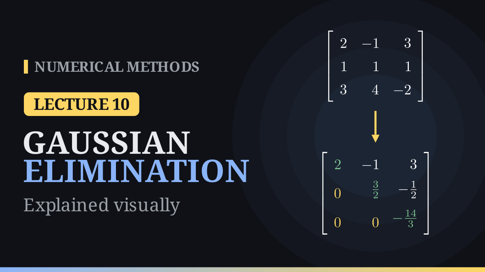

Lecture 10

# Gaussian Elimination

{ .nm-video }

[Practise this lecture](../practice/lec10_gaussian_elimination.html){ .md-button .md-button--primary }

#### Key results
- Row operations (adding a multiple of one row to another, swapping rows) do not change the solution of \(A\mathbf{x}=\mathbf{b}\).
- Multipliers \(m_{ik}=a_{ik}^{(k)}/a_{kk}^{(k)}\); row \(i\leftarrow\) row \(i-m_{ik}\,\)row \(k\) for the rows below \(k\).
- Back substitution: \(x_n=b_n/u_{nn}\), then \(x_i=\big(b_i-\sum_{j>i}u_{ij}x_j\big)/u_{ii}\).
- The product of the pivots is \(\det A\). A zero pivot stops the method; a small pivot ruins the accuracy.

## The problem

A system of \(n\) linear equations in \(n\) unknowns is written \(A\mathbf{x}=\mathbf{b}\). It has exactly one solution when \(\det A\neq0\). Gaussian elimination reduces it to an upper triangular system \(U\mathbf{x}=\mathbf{c}\) with the same solution, which back substitution then solves from the bottom up.

## Worked example

\[
\begin{aligned} 2x-y+3z&=9\\ x+y+z&=6\\ 3x+4y-2z&=5 \end{aligned}
\]

| step | multipliers | result |
|---|---|---|
| eliminate \(x\) | \(m_{21}=\frac12,\ m_{31}=\frac32\) | \(\frac32y-\frac12z=\frac32,\ \ \frac{11}{2}y-\frac{13}{2}z=-\frac{17}{2}\) |
| eliminate \(y\) | \(m_{32}=\frac{11}{3}\) | \(-\frac{14}{3}z=-14\) |
| back substitution | | \(z=3,\ y=2,\ x=1\) |

The pivots are \(2,\ \frac32,\ -\frac{14}{3}\), and their product \(-14\) is \(\det A\). The residual \(\mathbf{b}-A\mathbf{x}\) of the computed solution is zero.

## The algorithm

For \(k=1,\dots,n-1\) and \(i=k+1,\dots,n\):

\[
m_{ik}=\frac{a_{ik}^{(k)}}{a_{kk}^{(k)}},\qquad a_{ij}^{(k+1)}=a_{ij}^{(k)}-m_{ik}a_{kj}^{(k)},\qquad b_i^{(k+1)}=b_i^{(k)}-m_{ik}b_k^{(k)} .
\]

Then solve the upper triangular system by back substitution.

## When it fails

- **Zero pivot.** For \(x_2=1,\ x_1+x_2=2\) the first pivot is \(0\), although the solution \(x_1=x_2=1\) exists. Swapping the equations fixes it.
- **Small pivot.** For \(10^{-4}x_1+x_2=1,\ x_1+x_2=2\) in \(3\)-digit arithmetic, elimination gives \(x_1=0\) instead of \(1.0001\ldots\). The cure, pivoting, is the subject of Lecture 12.
- **Singular matrix.** If \(\det A=0\) no row swap helps: there is no solution (parallel lines) or there are infinitely many (the same line).

[Practise this lecture](../practice/lec10_gaussian_elimination.html){ .md-button .md-button--primary }
[← Previous: Machine Epsilon](lec09-rounding-errors.md){ .md-button }
[Next: Operation Count →](lec11-operation-count.md){ .md-button }

