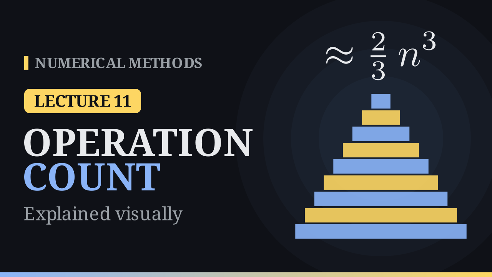

Lecture 11

# Operation Count of Gaussian Elimination

{ .nm-video }

[Practise this lecture](../practice/lec11_operation_count.html){ .md-button .md-button--primary }

#### Key results
- Forward elimination costs about \(\frac23n^3\) operations; back substitution about \(n^2\).
- Doubling \(n\) multiplies the work by \(8\).
- Cramer's rule with cofactor determinants needs about \((n+1)!\) operations; computing \(A^{-1}\) costs about \(2n^3\).
- With the elimination saved, each extra right-hand side costs only \(n^2\); a tridiagonal system costs \(O(n)\).

## Counting the work

At step \(k\) of forward elimination there are \(n-k\) rows below the pivot. Each needs one division (the multiplier), \((n-k)\) multiplications to update the row of \(A\) and one more for \(\mathbf{b}\). The block that changes is an \((n-k)\times(n-k)\) square that shrinks at every step; adding the squares gives \(\sum_{k=1}^{n-1}k^2\approx\frac{n^3}{3}\), the volume of a pyramid inside an \(n\times n\times n\) cube.

| | multiplications / divisions | additions / subtractions |
|---|---|---|
| forward elimination | \(\dfrac{2n^3+3n^2-5n}{6}\) | \(\dfrac{n^3-n}{3}\) |
| back substitution | \(\dfrac{n^2+n}{2}\) | \(\dfrac{n^2-n}{2}\) |
| total | \(\dfrac{n^3}{3}+n^2-\dfrac n3\) | \(\dfrac{n^3}{3}+\dfrac{n^2}{2}-\dfrac{5n}{6}\) |

## Some numbers

| \(n\) | operations | time at \(10^9\) operations per second |
|---:|---:|---:|
| \(3\) | \(28\) | |
| \(100\) | \(6.8\times10^5\) | |
| \(1000\) | \(6.7\times10^8\) | under a second |

## Comparisons

- **Cramer's rule** expands \(n+1\) determinants by cofactors, about \((n+1)!\) operations. For \(n=20\) that is \(5\times10^{19}\), more than a thousand years at \(10^9\) operations per second; elimination needs about \(5\,000\).
- **The inverse** costs about \(2n^3\), three times as much as elimination, and is less accurate. Never compute \(A^{-1}\) to solve \(A\mathbf{x}=\mathbf{b}\).
- **Many right-hand sides.** The elimination of \(A\) is the same for every \(\mathbf{b}\); saving the multipliers makes each new \(\mathbf{b}\) cost only \(n^2\). This is the \(LU\) factorisation.
- **Structure.** A triangular system costs \(n^2\), a tridiagonal one \(O(n)\).

[Practise this lecture](../practice/lec11_operation_count.html){ .md-button .md-button--primary }
[← Previous: Gaussian Elimination](lec10-gaussian-elimination.md){ .md-button }

