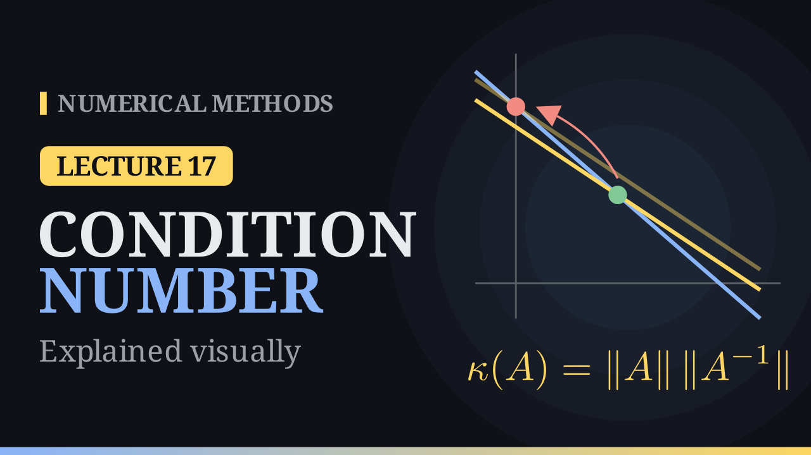

Lecture 17

# Sensitivity and Condition Number

{ .nm-video }

[Practise this lecture](../practice/lec17_conditioning.html){ .md-button .md-button--primary }

#### Key results
- The **condition number** \(\kappa(A)=\lVert A\rVert\,\lVert A^{-1}\rVert\ge1\) measures how sensitive \(A\mathbf x=\mathbf b\) is to its data.
- \(\dfrac{1}{\kappa(A)}\dfrac{\lVert\delta\mathbf b\rVert}{\lVert\mathbf b\rVert}\le\dfrac{\lVert\delta\mathbf x\rVert}{\lVert\mathbf x\rVert}\le\kappa(A)\dfrac{\lVert\delta\mathbf b\rVert}{\lVert\mathbf b\rVert}\); expect to lose about \(\log_{10}\kappa(A)\) digits.
- In the 2-norm, \(\kappa_2(A)=\sigma_{\max}/\sigma_{\min}\): the ratio of the axes of the ellipse that \(A\) maps the unit circle to.
- \(\dfrac{\lVert\mathbf x-\tilde{\mathbf x}\rVert}{\lVert\mathbf x\rVert}\le\kappa(A)\dfrac{\lVert\mathbf r\rVert}{\lVert\mathbf b\rVert}\): a small residual means a small error only when \(\kappa\) is small.

## A sensitive system

\[
x+y=2,\qquad x+1.0001\,y=2.0001\qquad\Rightarrow\qquad (x,y)=(1,1).
\]

Changing the second right-hand side by \(10^{-4}\), to \(2.0002\), gives \((x,y)=(0,2)\). The two lines are nearly parallel, so a small shift of one of them slides the crossing point a long way; for lines crossing at a good angle, such as \(x+y=2\) and \(x-y=0\), the same shift hardly moves it. In the \(\infty\)-norm the data changed by \(10^{-4}/2.0001\approx5\times10^{-5}\), the solution by \(100\%\).

## The bound

From \(A\,\delta\mathbf x=\delta\mathbf b\): \(\lVert\delta\mathbf x\rVert\le\lVert A^{-1}\rVert\,\lVert\delta\mathbf b\rVert\), and \(\lVert\mathbf b\rVert\le\lVert A\rVert\,\lVert\mathbf x\rVert\). Together,

\[
\frac{\lVert\delta\mathbf x\rVert}{\lVert\mathbf x\rVert}\le\lVert A\rVert\,\lVert A^{-1}\rVert\,\frac{\lVert\delta\mathbf b\rVert}{\lVert\mathbf b\rVert}=\kappa(A)\,\frac{\lVert\delta\mathbf b\rVert}{\lVert\mathbf b\rVert},
\qquad 1=\lVert I\rVert\le\lVert A\rVert\,\lVert A^{-1}\rVert=\kappa(A).
\]

For the example, \(A^{-1}=10^4\begin{bmatrix}1.0001&-1\\-1&1\end{bmatrix}\), \(\lVert A\rVert_\infty=2.0001\), \(\lVert A^{-1}\rVert_\infty=20\,001\) and \(\kappa_\infty(A)\approx4.0\times10^4\); the bound \(4\times10^4\cdot5\times10^{-5}=2\) contains the actual relative change \(1\). If \(A\) itself is perturbed, \(\dfrac{\lVert\delta\mathbf x\rVert}{\lVert\mathbf x\rVert}\le\dfrac{\kappa(A)}{1-\kappa(A)\lVert\delta A\rVert/\lVert A\rVert}\Big(\dfrac{\lVert\delta A\rVert}{\lVert A\rVert}+\dfrac{\lVert\delta\mathbf b\rVert}{\lVert\mathbf b\rVert}\Big)\), provided \(\kappa(A)\lVert\delta A\rVert/\lVert A\rVert<1\).

## Ill-conditioned matrices

| \(n\) | 3 | 4 | 5 | 12 |
|---|---:|---:|---:|---:|
| \(\kappa_2(H_n)\), Hilbert \(h_{ij}=\frac1{i+j-1}\) | \(524\) | \(1.55\times10^4\) | \(4.77\times10^5\) | \(1.8\times10^{16}\) |

- The **determinant is no test**: \(0.1\,I_n\) has \(\det=10^{-n}\) but \(\kappa=1\).
- **Small residual, large error:** for \(\tilde{\mathbf x}=(0,2)\), \(\mathbf r=\mathbf b-A\tilde{\mathbf x}=(0,-10^{-4})\), a relative residual of \(5\times10^{-5}\), while the error is \(100\%\).
- Conditioning is a property of the **problem**; stability (e.g. pivoting) is a property of the **method**. Remedies: reformulate or rescale, use higher precision, and avoid forming \(A^TA\) (it squares \(\kappa_2\)).

[Practise this lecture](../practice/lec17_conditioning.html){ .md-button .md-button--primary }
[← Previous: Norms](lec16-norms.md){ .md-button }

