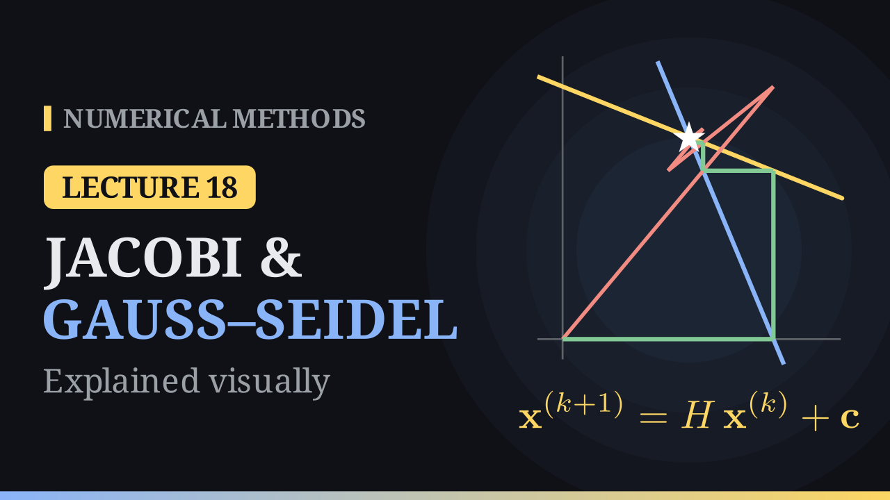

Lecture 18

# Jacobi and Gauss–Seidel Methods

{ .nm-video }

[Practise this lecture](../practice/lec18_jacobi_gauss_seidel.html){ .md-button .md-button--primary }

#### Key results
- **Jacobi:** \(x_i^{(k+1)}=\dfrac{1}{a_{ii}}\Big(b_i-\sum_{j\ne i}a_{ij}x_j^{(k)}\Big)\), using only the old values.
- **Gauss–Seidel:** the same formula, but each new value \(x_j^{(k+1)}\) is used as soon as it is computed; it is usually faster and needs only one vector.
- One sweep costs about \(n^2\) operations (far fewer for sparse matrices), against \(\tfrac23n^3\) for elimination.
- Both methods converge when \(A\) is **strictly diagonally dominant**, \(|a_{ii}|>\sum_{j\ne i}|a_{ij}|\); without dominance they can diverge, and reordering the equations often helps.

## The idea

Solve the \(i\)-th equation for \(x_i\), put in the current guess for the other unknowns, and repeat. For \(3x+y=5,\ x+2y=5\) (solution \((1,2)\)) from \((0,0)\):

| sweep | Jacobi \((x,y)\) | Gauss–Seidel \((x,y)\) |
|---|---|---|
| 1 | \((1.667,\ 2.5)\) | \((1.667,\ 1.667)\) |
| 2 | \((0.833,\ 1.667)\) | \((1.111,\ 1.944)\) |
| 3 | \((1.111,\ 2.083)\) | \((1.019,\ 1.991)\) |

In the plane, Jacobi zig-zags around the solution, while Gauss–Seidel climbs a staircase between the two lines.

## Jacobi: an example from the notes

\[
\begin{aligned}3x_1+x_2-x_3&=7\\2x_1-5x_2+2x_3&=-8\\x_1+x_2+10x_3&=6\end{aligned}
\qquad
\begin{aligned}x_1^{(k+1)}&=\tfrac13\big(7-x_2^{(k)}+x_3^{(k)}\big)\\x_2^{(k+1)}&=\tfrac15\big(8+2x_1^{(k)}+2x_3^{(k)}\big)\\x_3^{(k+1)}&=\tfrac1{10}\big(6-x_1^{(k)}-x_2^{(k)}\big)\end{aligned}
\]

| \(k\) | \(x_1\) | \(x_2\) | \(x_3\) |
|---|---:|---:|---:|
| 0 | 0 | 0 | 0 |
| 1 | 2.3333 | 1.6000 | 0.6000 |
| 2 | 2.0000 | 2.7733 | 0.2067 |
| \(\infty\) | 1.6243 | 2.3315 | 0.2044 |

To reach an error of \(10^{-6}\), Jacobi needs 19 sweeps and Gauss–Seidel 11.

## Gauss–Seidel: an example from the notes

For \(-4x_1+x_2+x_3=0,\ x_1-4x_2+x_3=-5,\ x_1+x_2-4x_3=-5\) (solution \((1,2,2)\)), Gauss–Seidel from \(\mathbf 0\) gives

\[
\mathbf x^{(1)}=(0,\ 1.25,\ 1.5625),\qquad \mathbf x^{(2)}=(0.7031,\ 1.8164,\ 1.8799).
\]

## Stopping, cost and failure

- Stop when \(\lVert\mathbf x^{(k+1)}-\mathbf x^{(k)}\rVert_\infty\) (or its relative version) is below a tolerance, with a cap on the number of sweeps.
- Writing the same equations in the other order, \(x+2y=5,\ 3x+y=5\), Jacobi gives \((5,5),\ (-5,-10),\ (25,20),\dots\) and diverges.
- **Diagonal dominance** guarantees convergence. If it fails, reordering can restore it: \(\begin{bmatrix}8&1\\2&10\end{bmatrix}\mathbf x=\begin{bmatrix}9\\12\end{bmatrix}\) converges quickly, \((1.125,1.2),\ (0.975,0.975),\ (1.0031,1.005)\).

[Practise this lecture](../practice/lec18_jacobi_gauss_seidel.html){ .md-button .md-button--primary }
[← Previous: Condition Number](lec17-conditioning.md){ .md-button }
[Next: Convergence of Iterative Methods →](lec19-iterative-convergence.md){ .md-button }

