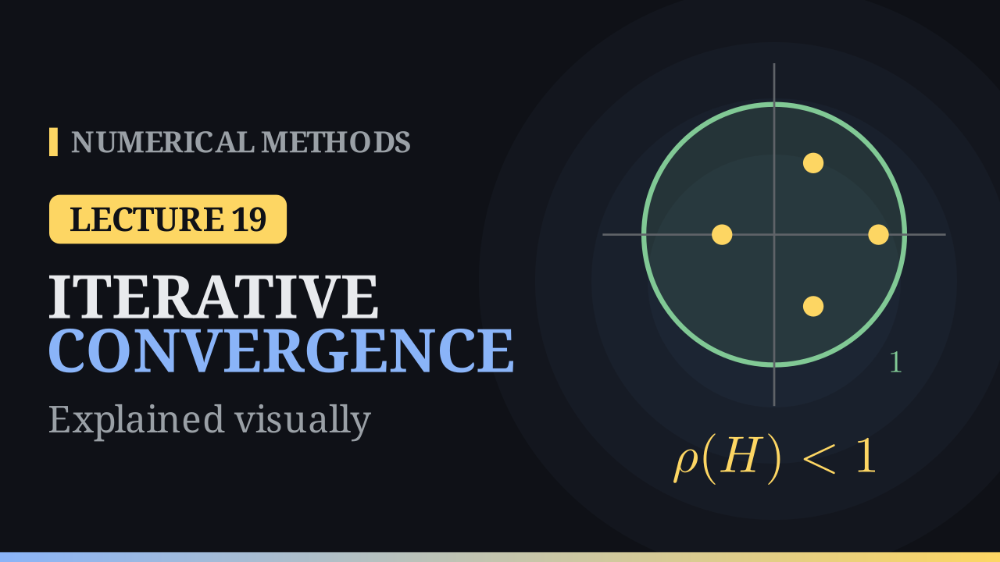

Lecture 19

# Convergence of Iterative Methods

{ .nm-video }

[Practise this lecture](../practice/lec19_iterative_convergence.html){ .md-button .md-button--primary }

#### Key results
- A splitting \(A=Q-(Q-A)\) gives \(\mathbf x^{(k+1)}=H\mathbf x^{(k)}+\mathbf c\) with \(H=I-Q^{-1}A\), \(\mathbf c=Q^{-1}\mathbf b\). Jacobi: \(Q=D\); Gauss–Seidel: \(Q=D+L\).
- The error obeys \(\mathbf e^{(k)}=H^k\mathbf e^{(0)}\); the iteration converges for every start **if and only if** \(\rho(H)<1\).
- About \(d/(-\log_{10}\rho(H))\) sweeps reduce the error by \(10^{-d}\); the rate of convergence is \(-\log_{10}\rho(H)\).
- Strictly diagonally dominant \(A\): Jacobi and Gauss–Seidel converge. Symmetric positive definite \(A\): Gauss–Seidel converges.

## The error and the spectral radius

Subtracting \(\mathbf x=H\mathbf x+\mathbf c\) from the iteration gives \(\mathbf e^{(k+1)}=H\mathbf e^{(k)}\). Any induced norm gives \(\lVert\mathbf e^{(k)}\rVert\le\lVert H\rVert^k\lVert\mathbf e^{(0)}\rVert\), so \(\lVert H\rVert<1\) is enough. The sharp test is the spectral radius \(\rho(H)=\max_i|\lambda_i|\): writing \(\mathbf e^{(0)}=c_1\mathbf v_1+\dots+c_n\mathbf v_n\) in eigenvectors, \(\mathbf e^{(k)}=c_1\lambda_1^k\mathbf v_1+\dots+c_n\lambda_n^k\mathbf v_n\), and every component dies out exactly when all \(|\lambda_i|<1\).

## Examples

- For the Jacobi example of Lecture 18, \(H_J=\begin{bmatrix}0&-\tfrac13&\tfrac13\\0.4&0&0.4\\-0.1&-0.1&0\end{bmatrix}\), \(\lVert H_J\rVert_\infty=0.8\), \(\rho(H_J)=0.4546\) and \(\rho(H_{GS})=0.2695\): 19 and 11 sweeps for \(10^{-6}\).
- \(A=\begin{bmatrix}2&1\\1&2\end{bmatrix}\): \(H_J=\begin{bmatrix}0&-\tfrac12\\-\tfrac12&0\end{bmatrix}\) (eigenvalues \(\pm\tfrac12\)), \(H_{GS}=\begin{bmatrix}0&-\tfrac12\\0&\tfrac14\end{bmatrix}\) (eigenvalues \(0,\tfrac14\)): about 20 against 10 sweeps.

| \(\rho(H)\) | 0.1 | 0.5 | 0.9 | 0.99 |
|---|---:|---:|---:|---:|
| sweeps per digit | 1 | 3.3 | 22 | 230 |

## Sufficient conditions and surprises

- **Diagonal dominance:** \(\lVert H_J\rVert_\infty=\max_i\sum_{j\ne i}|a_{ij}|/|a_{ii}|<1\), so Jacobi converges; Gauss–Seidel converges too.
- **SPD matrices:** Gauss–Seidel always converges, Jacobi need not: for the matrix with \(1\) on the diagonal and \(0.8\) elsewhere (\(3\times3\)), \(\rho(H_J)=1.6\) but \(\rho(H_{GS})=0.7155\).
- **Neither always wins:** for \(\begin{bmatrix}1&2&-2\\1&1&1\\2&2&1\end{bmatrix}\), \(H_J^3=0\) (Jacobi is exact after 3 sweeps) while \(\rho(H_{GS})=2\).
- A small change between sweeps does not mean a small error when \(\rho\) is close to \(1\): the error can be about \(\tfrac{\rho}{1-\rho}\) times the change, \(99\) times for \(\rho=0.99\).

[Practise this lecture](../practice/lec19_iterative_convergence.html){ .md-button .md-button--primary }
[← Previous: Jacobi and Gauss–Seidel](lec18-jacobi-gauss-seidel.md){ .md-button }
[Next: SOR →](lec20-sor.md){ .md-button }

