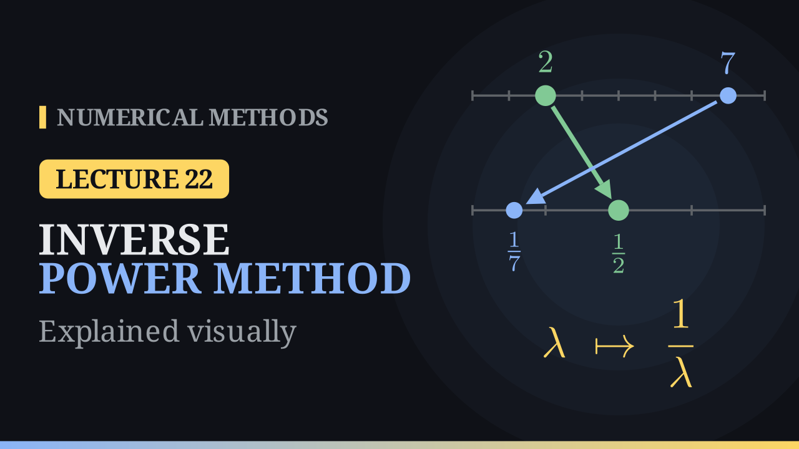

Lecture 22

# The Inverse Power Method

{ .nm-video }

[Practise this lecture](../practice/lec22_inverse_power.html){ .md-button .md-button--primary }

#### Key results
- \(A\mathbf x=\lambda\mathbf x\Rightarrow A^{-1}\mathbf x=\frac1\lambda\mathbf x\): \(A^{-1}\) has the same eigenvectors and reciprocal eigenvalues, so the smallest \(|\lambda|\) becomes the dominant one.
- **Inverse power method:** solve \(A\mathbf y^{(k)}=\mathbf v^{(k-1)}\), \(\alpha^{(k)}=\) the entry of \(\mathbf y^{(k)}\) of largest size (with its sign), \(\lambda^{(k)}=1/\alpha^{(k)}\), \(\mathbf v^{(k)}=\mathbf y^{(k)}/\alpha^{(k)}\).
- Never form \(A^{-1}\): factorise \(A=LU\) once (about \(n^3/3\) operations), then two triangular solves per step (about \(n^2\)).
- The rate is \(|\lambda_n/\lambda_{n-1}|\).

## The example from the notes

\(A=\begin{bmatrix}4&3\\2&5\end{bmatrix}=\begin{bmatrix}1&0\\ \frac12&1\end{bmatrix}\begin{bmatrix}4&3\\0&\frac72\end{bmatrix}\), \(\mathbf v^{(0)}=(1,0)\). The first step solves \(L\mathbf z=(1,0)^T\), \(\mathbf z=(1,-\frac12)\), then \(U\mathbf y^{(1)}=\mathbf z\), \(\mathbf y^{(1)}=(\frac5{14},-\frac17)\): \(\lambda^{(1)}=\frac{14}{5}=2.8\), \(\mathbf v^{(1)}=(1,-0.4)\).

| \(k\) | 1 | 2 | 3 | 4 | 5 | 6 |
|---|---:|---:|---:|---:|---:|---:|
| \(\lambda^{(k)}\) | 2.8000 | 2.2581 | 2.0766 | 2.0221 | 2.0063 | 2.0018 |
| \(v^{(k)}_2\) | −0.4000 | −0.5806 | −0.6411 | −0.6593 | −0.6646 | −0.6661 |

The eigenvalues are \(2\) and \(7\) (\(\lambda^2-9\lambda+14=0\)), with \(\mathbf x_2=(1,-\frac23)\). The error ratios \(0.323,\ 0.297,\ 0.289,\dots\) approach \(2/7\approx0.286\), and \(12\) iterations give an error below \(10^{-6}\). The residual check: for \(\lambda=2.0063\), \(\mathbf v=(1,-0.6646)\), \(A\mathbf v-\lambda\mathbf v\approx(-0.0001,\ 0.0104)\).

## Both ends of the spectrum

For \(A=\begin{bmatrix}3&1&0\\1&2&1\\0&1&4\end{bmatrix}\) the power method of Lecture 21 finds \(4.5321\); the inverse power method gives \(3.4,\ 2.4286,\ 1.6346,\ 1.2822,\ 1.1679,\dots\to1.1206\) at rate \(1.1206/3.3473\approx0.33\) (\(15\) iterations for \(10^{-6}\)), against \(0.74\) for the power method.

## Remarks

- A nearly singular \(A\) is not a problem here: the large solution \(\mathbf y\) points almost exactly along \(\mathbf x_n\), and scaling removes its size.
- The method fails when two eigenvalues share the smallest size (e.g. \(\pm1\)), or when the start has no component along \(\mathbf x_n\). If \(0\) is an eigenvalue, \(A\) is singular and \(\lambda_n=0\) is already known.

[Practise this lecture](../practice/lec22_inverse_power.html){ .md-button .md-button--primary }
[← Previous: The Power Method](lec21-power-method.md){ .md-button }
[Next: The Shifted Inverse Power Method →](lec23-shifted-inverse-power.md){ .md-button }

