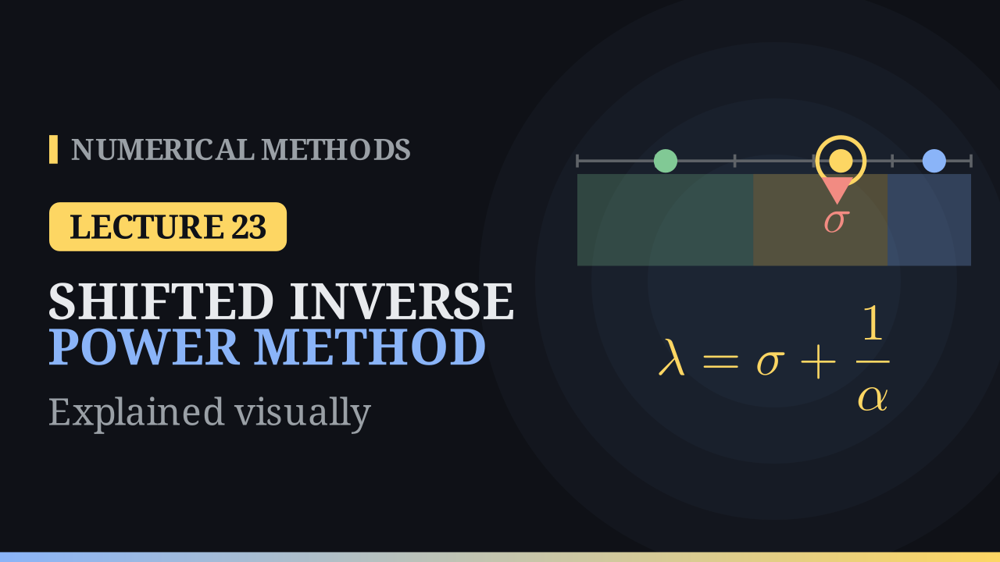

Lecture 23

# The Shifted Inverse Power Method

{ .nm-video }

[Practise this lecture](../practice/lec23_shifted_inverse_power.html){ .md-button .md-button--primary }

#### Key results
- \((A-\sigma I)^{-1}\mathbf x=\frac{1}{\lambda-\sigma}\mathbf x\): the eigenvalue nearest to the shift \(\sigma\) becomes dominant.
- **Shifted inverse power method:** solve \((A-\sigma I)\mathbf y^{(k)}=\mathbf v^{(k-1)}\), \(\alpha^{(k)}=\) the entry of largest size, \(\mathbf v^{(k)}=\mathbf y^{(k)}/\alpha^{(k)}\), \(\lambda^{(k)}=\sigma+1/\alpha^{(k)}\). With \(\sigma=0\) it is the inverse power method.
- The rate is \(\dfrac{|\lambda_J-\sigma|}{|\lambda_K-\sigma|}\) (nearest over next nearest): the closer \(\sigma\), the faster.
- Rayleigh quotient iteration updates \(\sigma\) every step and converges cubically for symmetric \(A\), at the cost of a new factorisation per step.

## The example from the notes

For \(A=\begin{bmatrix}4&3\\2&5\end{bmatrix}\) (eigenvalues \(2\) and \(7\)) and \(\sigma=6\), \(A-6I=\begin{bmatrix}-2&3\\2&-1\end{bmatrix}\), \((A-6I)^{-1}=\frac14\begin{bmatrix}1&3\\2&2\end{bmatrix}\). From \(\mathbf v^{(0)}=(1,0)\):

| \(k\) | 1 | 2 | 3 | 4 | 5 |
|---|---:|---:|---:|---:|---:|
| \(\lambda^{(k)},\ \sigma=6\) | 8.0000 | 7.1429 | 7.0769 | 7.0097 | 7.0049 |
| \(\lambda^{(k)},\ \sigma=6.9\) | 7.14500 | 7.00198 | 7.00006 | 7.00000 | |

The rate is \(|7-6|/|2-6|=0.25\) for \(\sigma=6\) and \(0.1/4.9\approx0.02\) for \(\sigma=6.9\): \(12\) and \(4\) iterations for \(10^{-6}\), against \(14\) for the power method.

## The middle eigenvalue

For \(A=\begin{bmatrix}3&1&0\\1&2&1\\0&1&4\end{bmatrix}\) (eigenvalues \(1.1206,\ 3.3473,\ 4.5321\)), \(\sigma=3.3\) gives \(3.37888,\ 3.34878,\ 3.34735,\ 3.34730\): six decimals after five iterations, at rate \(0.038\), with eigenvector \((1,\ 0.3473,\ -0.5321)\) and residual below \(2\times10^{-5}\). Together with the power and inverse power methods this gives the whole spectrum. A shift below \(2.23\) finds \(1.1206\), between \(2.23\) and \(3.94\) finds \(3.3473\), above \(3.94\) finds \(4.5321\).

| \(\sigma\) | 3.0 | 3.3 | 3.34 |
|---|---:|---:|---:|
| rate | 0.227 | 0.038 | 0.006 |

## Rayleigh quotient iteration

With \(\sigma_k=r(\mathbf v^{(k)})=\dfrac{\mathbf v^{(k)T}A\mathbf v^{(k)}}{\mathbf v^{(k)T}\mathbf v^{(k)}}\) from \(\mathbf v=(1,1,1)/\sqrt3\): \(4.3333,\ 4.5230,\ 4.53208835,\ 4.53208889\), with errors \(2\times10^{-1},\ 9\times10^{-3},\ 5\times10^{-7},\ 9\times10^{-16}\). Each step needs a new factorisation (\(n^3/3\) operations), so a fixed shift is often cheaper for large matrices.

[Practise this lecture](../practice/lec23_shifted_inverse_power.html){ .md-button .md-button--primary }
[← Previous: The Inverse Power Method](lec22-inverse-power.md){ .md-button }

