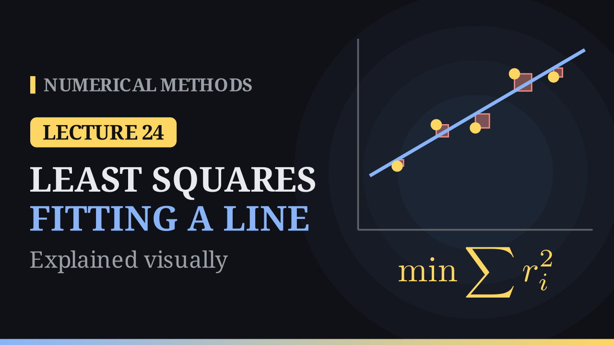

Lecture 24

# Least Squares: Fitting a Line

{ .nm-video }

[Practise this lecture](../practice/lec24_least_squares_line.html){ .md-button .md-button--primary }

#### Key results
- For data \((x_i,y_i),\ i=0,\dots,m\), least squares chooses \(a_0,a_1\) to minimise \(E(a_0,a_1)=\sum_{i=0}^{m}\big(y_i-(a_0+a_1x_i)\big)^2\), the sum of squared residuals.
- **Normal equations:** \((m+1)a_0+a_1\sum x_i=\sum y_i,\qquad a_0\sum x_i+a_1\sum x_i^2=\sum x_iy_i\).
- The residuals sum to zero, so the line passes through \((\bar x,\bar y)\); the slope is \(a_1=\dfrac{\sum(x_i-\bar x)(y_i-\bar y)}{\sum(x_i-\bar x)^2}\).
- In matrix form \(A^TA\,\mathbf a=A^T\mathbf y\). Centre the data to keep \(A^TA\) well conditioned; a pattern in the residuals means a line is the wrong model.

## Why squares?

The plain sum \(\sum r_i\) is useless: positive and negative residuals cancel, and every line through \((\bar x,\bar y)\) gives zero. The sum \(\sum|r_i|\) has corners where a residual vanishes. The sum of squares \(E\) is smooth, has a single minimum (a bowl over the \((a_0,a_1)\) plane), and punishes large errors most. At the bottom of the bowl,

\[
\frac{\partial E}{\partial a_0}=-2\sum_{i=0}^{m}\big(y_i-a_0-a_1x_i\big)=0,\qquad
\frac{\partial E}{\partial a_1}=-2\sum_{i=0}^{m}\big(y_i-a_0-a_1x_i\big)x_i=0,
\]

which rearrange to the normal equations.

## The example from the notes

For \((1,2.2),\ (2,2.8),\ (3,3.6),\ (4,4.5),\ (5,5.1)\): \(m+1=5\), \(\sum x_i=15\), \(\sum y_i=18.2\), \(\sum x_i^2=55\), \(\sum x_iy_i=62.1\), so

\[
5a_0+15a_1=18.2,\qquad 15a_0+55a_1=62.1,
\]

giving \(a_1=0.75\), \(a_0=1.39\): the least squares line is \(y=1.39+0.75x\).

| \(x_i\) | 1 | 2 | 3 | 4 | 5 |
|---|---:|---:|---:|---:|---:|
| \(y_i\) | 2.2 | 2.8 | 3.6 | 4.5 | 5.1 |
| \(1.39+0.75x_i\) | 2.14 | 2.89 | 3.64 | 4.39 | 5.14 |
| \(r_i\) | \(+0.06\) | \(-0.09\) | \(-0.04\) | \(+0.11\) | \(-0.04\) |

The residuals add up to \(0\) and \(E=\sum r_i^2=0.027\). The line through the first and last points gives \(E=0.034\), the line \(1.5+0.7x\) gives \(E=0.06\). The mean point is \((3,\ 3.64)\) and the slope is \(7.5/10=0.75\). At \(x=6\) the line predicts \(5.89\); the degree-four polynomial through all five points predicts \(4.7\).

## Outliers, conditioning and the wrong model

- Changing the last value from \(5.1\) to \(8.1\) changes the line to \(y=0.19+1.35x\): one outlier almost doubles the slope.
- With \(x=2021,\dots,2025\) the matrix \(A^TA\) has condition number about \(8\times10^{12}\); with \(x=1,\dots,5\) about \(70\). Centring (\(x-\bar x\)) makes \(A^TA=\begin{bmatrix}5&0\\0&10\end{bmatrix}\).
- For the curved data \(1.0,\ 1.9,\ 3.9,\ 7.1,\ 11.2\) the line leaves residuals \(+1.1,\ -0.56,\ -1.12,\ -0.48,\ +1.06\): a pattern, so a curve is needed (next lecture).

[Practise this lecture](../practice/lec24_least_squares_line.html){ .md-button .md-button--primary }
[← Previous: The Shifted Inverse Power Method](lec23-shifted-inverse-power.md){ .md-button }

