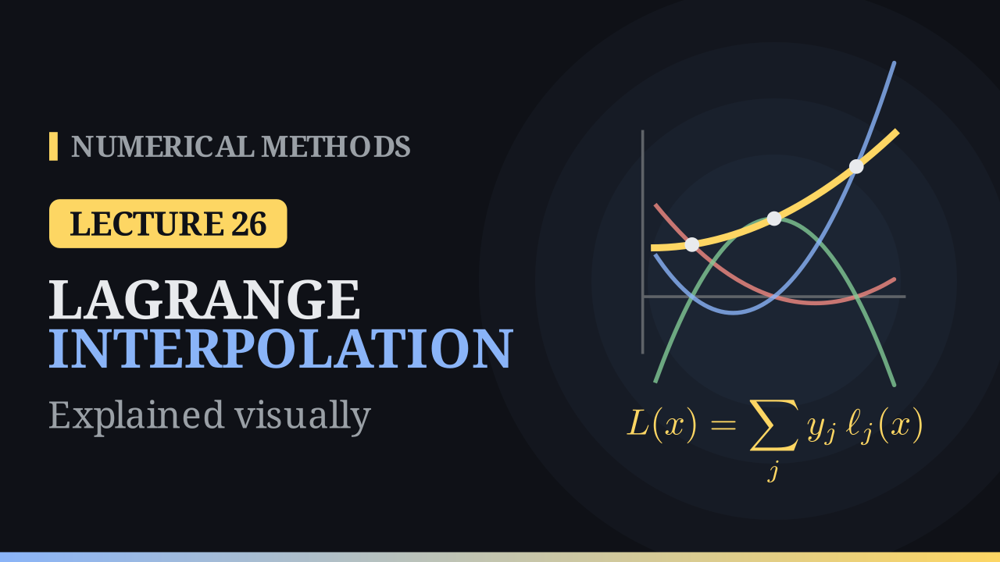

Lecture 26

# Lagrange Interpolation

{ .nm-video }

[Practise this lecture](../practice/lec26_lagrange.html){ .md-button .md-button--primary }

#### Key results
- Through \(n+1\) points \((x_i,y_i)\) with distinct nodes there is exactly one polynomial \(L\) of degree at most \(n\) with \(L(x_i)=y_i\).
- Lagrange form: \(L(x)=\sum_{j=0}^{n}y_j\,\ell_j(x)\) with basis polynomials \(\ell_j(x)=\prod_{m\ne j}\dfrac{x-x_m}{x_j-x_m}\), which satisfy \(\ell_j(x_i)=\delta_{ij}\).
- Partition of unity: \(\sum_j\ell_j(x)=1\), and \(\sum_j x_j\,\ell_j(x)=x\).
- Evaluating \(L\) at a point costs about \(n^2\) operations and needs no linear system; adding a node changes every \(\ell_j\).

## Least squares or interpolation?

Least squares (Lectures 24 and 25) fits a curve *near* noisy data, leaving a small but nonzero error \(E\). Interpolation asks for a curve that passes *exactly* through every point. That is the right goal when the data are exact, such as values from a table or from a function that is costly to evaluate.

## The direct approach

Writing \(L(x)=a_0+a_1x+a_2x^2\) and imposing \(L(x_i)=y_i\) for \((1,2),\ (2,3),\ (3,5)\) gives a linear system with the Vandermonde matrix:

\[
\begin{bmatrix}1&1&1\\1&2&4\\1&3&9\end{bmatrix}\begin{bmatrix}a_0\\a_1\\a_2\end{bmatrix}=\begin{bmatrix}2\\3\\5\end{bmatrix},
\qquad a_0=2,\ a_1=-\tfrac12,\ a_2=\tfrac12 .
\]

This works, but it needs a linear solve, and for many equally spaced nodes the Vandermonde matrix is badly conditioned (for \(11\) nodes on \([0,1]\), \(\kappa(V)\approx1.2\times10^{8}\)).

## The basis polynomials

Lagrange builds one polynomial per node that is \(1\) at its own node and \(0\) at all the others. For the nodes \(1,2,3\), the product \((x-2)(x-3)\) vanishes at \(2\) and \(3\) and equals \((1-2)(1-3)=2\) at \(x=1\); dividing by \(2\) gives \(\ell_0\). In the same way

\[
\ell_0(x)=\tfrac12(x-2)(x-3),\qquad \ell_1(x)=-(x-1)(x-3),\qquad \ell_2(x)=\tfrac12(x-1)(x-2).
\]

If \(L(x)=\sum_j a_j\ell_j(x)\), then \(L(x_i)=\sum_j a_j\delta_{ij}=a_i\), so the interpolation conditions give \(a_i=y_i\) directly.

## The worked example

\[
L(x)=2\cdot\frac{(x-2)(x-3)}{(1-2)(1-3)}+3\cdot\frac{(x-1)(x-3)}{(2-1)(2-3)}+5\cdot\frac{(x-1)(x-2)}{(3-1)(3-2)}=\tfrac12\left(x^2-x+4\right),
\]

the same polynomial as the Vandermonde solution \(2-\tfrac12x+\tfrac12x^2\), found without solving a system. To evaluate at \(x=2.5\) there is no need to expand:

| \(j\) | \(x_j\) | \(y_j\) | \(\ell_j(2.5)\) | \(y_j\,\ell_j(2.5)\) |
|---:|---:|---:|---:|---:|
| 0 | 1 | 2 | \(-0.125\) | \(-0.25\) |
| 1 | 2 | 3 | \(0.75\) | \(2.25\) |
| 2 | 3 | 5 | \(0.375\) | \(1.875\) |
| | | | sum | \(3.875\) |

so \(L(2.5)=3.875\). For two points the Lagrange form is ordinary linear interpolation, \(L(x)=y_0+\frac{y_1-y_0}{x_1-x_0}(x-x_0)\).

## Uniqueness and the partition of unity

If \(P\) and \(Q\) both interpolate the data with degree at most \(n\), then \(R=P-Q\) has degree at most \(n\) and \(n+1\) zeros, so \(R\equiv0\). Lagrange, Vandermonde and Newton forms all describe the same polynomial. Applying the same argument to \(\sum_j\ell_j(x)-1\) shows that the basis polynomials add up to \(1\) for every \(x\); at \(x=2.5\), \(-0.125+0.75+0.375=1\).

## Weak points

- **Adding a node** changes every basis polynomial. With the extra point \((4,4)\) the cubic interpolant gives \(L(2.5)=4.125\) instead of \(3.875\), and everything is recomputed. Newton's form (next lecture) adds one term instead.
- **High degree on equally spaced nodes** can oscillate: for \(f(x)=1/(1+25x^2)\) at \(11\) equally spaced nodes on \([-1,1]\), the degree-10 interpolant has a maximum error of about \(1.92\) near the ends (the Runge phenomenon).
- **Extrapolation** is unreliable: the cubic through \(\sin x\) at \(0,1,2,3\) gives \(0.63\) at \(x=2.5\) (true \(0.60\)) but \(-4.15\) at \(x=5\) (true \(-0.96\)).
- **The nodes must be distinct**, or the denominators \(x_j-x_m\) vanish.

[Practise this lecture](../practice/lec26_lagrange.html){ .md-button .md-button--primary }
[← Previous: Least Squares, Polynomial Fit](lec25-least-squares-poly.md){ .md-button }
[Next: Newton's Divided Differences →](lec27-divided-differences.md){ .md-button }

