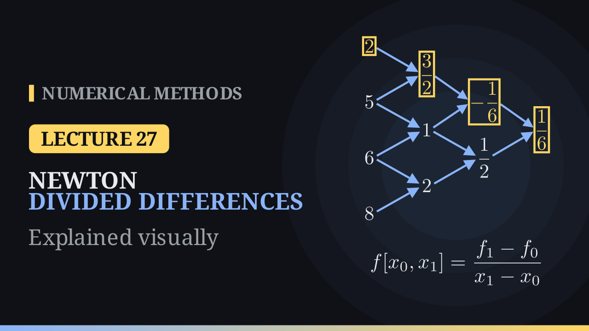

Lecture 27

# Newton Divided Differences

{ .nm-video }

[Practise this lecture](../practice/lec27_divided_differences.html){ .md-button .md-button--primary }

#### Key results
- **Newton form:** \(P(x)=f[x_0]+f[x_0,x_1](x-x_0)+f[x_0,x_1,x_2](x-x_0)(x-x_1)+\dots+f[x_0,\dots,x_n](x-x_0)\cdots(x-x_{n-1})\), the same polynomial as Lagrange's.
- **Divided differences:** \(f[x_i]=f(x_i)\) and \(f[x_i,\dots,x_{i+k}]=\dfrac{f[x_{i+1},\dots,x_{i+k}]-f[x_i,\dots,x_{i+k-1}]}{x_{i+k}-x_i}\); the coefficients are the top diagonal of the table.
- A new node adds one diagonal to the table and one term to the polynomial; nothing else changes.
- Nested evaluation needs only \(n\) multiplications; building the table needs \(n(n+1)/2\) divisions.
- \(f[x_0,\dots,x_n]=\sum_i f(x_i)/w'(x_i)\) does not depend on the order of the nodes, and \(f[x_0,\dots,x_k]=f^{(k)}(\xi)/k!\).

## Growing the polynomial

Lagrange's form \(P(x)=\sum_j y_j\,\ell_j(x)\) must be rebuilt from scratch when a node is added, because every \(\ell_j\) changes. Newton's form grows instead: \(P_k(x)=P_{k-1}(x)+c_k(x-x_0)\cdots(x-x_{k-1})\). The new term vanishes at \(x_0,\dots,x_{k-1}\), so the earlier interpolation conditions are kept, and \(c_k\) is chosen to fit the new point. Matching \(x_0\) and \(x_1\) gives

\[
c_0=y_0,\qquad c_1=\frac{y_1-y_0}{x_1-x_0}=f[x_0,x_1],
\]

and in general \(c_k=f[x_0,x_1,\dots,x_k]\).

## The worked example

For \((1,2),\ (3,5),\ (4,6),\ (5,8)\) the divided-difference table is

| \(x_i\) | \(f[x_i]\) | 1st DD | 2nd DD | 3rd DD |
|---:|---:|---:|---:|---:|
| \(1\) | \(2\) | \(\tfrac32\) | \(-\tfrac16\) | \(\tfrac16\) |
| \(3\) | \(5\) | \(1\) | \(\tfrac12\) | |
| \(4\) | \(6\) | \(2\) | | |
| \(5\) | \(8\) | | | |

with, for example, \(f[1,3]=\frac{5-2}{3-1}=\frac32\), \(f[1,3,4]=\frac{1-3/2}{4-1}=-\frac16\) and \(f[1,3,4,5]=\frac{1/2-(-1/6)}{5-1}=\frac16\). Reading the top row,

\[
P_3(x)=2+\tfrac32(x-1)-\tfrac16(x-1)(x-3)+\tfrac16(x-1)(x-3)(x-4).
\]

At \(x=2\) the terms give \(P_3(2)=2+\tfrac32+\tfrac16+\tfrac13=4\); the partial sums \(P_0(2),\dots,P_3(2)\) are \(2,\ 3.5,\ 3.667,\ 4\). Rounding \(\mp\tfrac16\) to \(\mp0.1667\) gives \(4.0001\), a rounding artefact. In nested form

\[
P_3(x)=2+(x-1)\Big[\tfrac32+(x-3)\big[-\tfrac16+(x-4)\cdot\tfrac16\big]\Big],
\]

and at \(x=2\) the brackets give \(-\tfrac12\), then \(2\), then \(4\).

## Adding a point

With a fifth point \((6,7)\) only the new bottom diagonal is computed: \(f[5,6]=-1\), \(f[4,5,6]=-\tfrac32\), \(f[3,4,5,6]=-\tfrac23\) and \(f[1,3,4,5,6]=-\tfrac16\). Then

\[
P_4(x)=P_3(x)-\tfrac16(x-1)(x-3)(x-4)(x-5),
\]

which still passes through the four old points; the estimate at \(x=2\) moves from \(4\) to \(P_4(2)=5\).

## Properties and pitfalls

The symmetric formula checks the example: \(f[1,3,4,5]=\frac{2}{-24}+\frac54+\frac{6}{-3}+\frac88=\frac16\). For \(f(x)=x^3\) at \(0,1,2,3,4\) the third divided differences are all \(1=3!/3!\) and the fourth is \(0\). The nodes must be distinct; nearly equal nodes cause cancellation (with \(e^x\) rounded to four decimals at \(1,\ 1.001,\ 1.002\), the second divided difference comes out as \(0\) instead of about \(1.36\)), and an error in one value spreads to every entry to its right.

[Practise this lecture](../practice/lec27_divided_differences.html){ .md-button .md-button--primary }
[← Previous: Lagrange Interpolation](lec26-lagrange.md){ .md-button }
[Next: The Interpolation Error →](lec28-interpolation-error.md){ .md-button }

