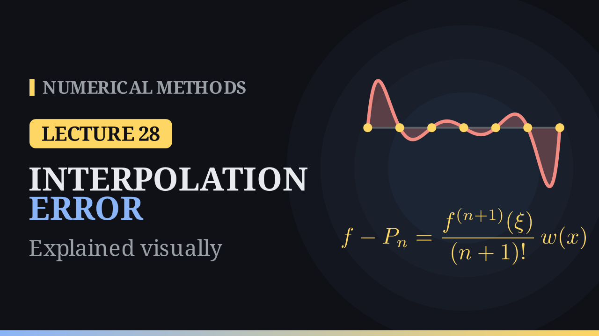

Lecture 28

# The Interpolation Error

{ .nm-video }

[Practise this lecture](../practice/lec28_interpolation_error.html){ .md-button .md-button--primary }

#### Key results
- If \(f\) has \(n\) derivatives, \(f[x_0,x_1,\dots,x_n]=\dfrac{f^{(n)}(\xi)}{n!}\) for some \(\xi\) between the smallest and the largest node.
- If \(f\in C^{n+1}[a,b]\) and \(P_n\) interpolates \(f\) at distinct nodes \(x_0,\dots,x_n\in[a,b]\), then for each \(x\) there is \(\xi=\xi(x)\in(a,b)\) with
  \(f(x)-P_n(x)=\dfrac{f^{(n+1)}(\xi)}{(n+1)!}\,w(x)\), where \(w(x)=\prod_{i=0}^{n}(x-x_i)\) is the node polynomial.
- Bound: \(|f(x)-P_n(x)|\le\dfrac{M}{(n+1)!}\max_{[a,b]}|w(x)|\) with \(M=\max_{[a,b]}|f^{(n+1)}|\). For linear interpolation with spacing \(h\): \(|f(x)-P_1(x)|\le\dfrac{h^2}{8}\max|f''|\).
- With equally spaced nodes \(|w|\) is small in the middle of the interval and much larger near the ends.

## Divided differences and derivatives

Let \(g=f-P\), where \(P\) interpolates \(f\) at \(x_0,\dots,x_n\). Then \(g\) has the \(n+1\) zeros \(x_0,\dots,x_n\). Rolle's theorem applied to \(g, g', \dots\) gives a point \(\xi\) with \(g^{(n)}(\xi)=0\). In Newton form only the last term of \(P\) contains \(t^n\), with coefficient \(f[x_0,\dots,x_n]\), so \(P^{(n)}(t)=n!\,f[x_0,\dots,x_n]\) and

\[
0=g^{(n)}(\xi)=f^{(n)}(\xi)-n!\,f[x_0,\dots,x_n].
\]

For \(n=1\) this is the mean value theorem. For \(f(x)=e^x\) at the nodes \(0,1,2\): \(f[0,1]=e-1=1.7183=e^{\xi}\) with \(\xi=0.541\), and \(f[0,1,2]=1.4762=e^{\xi}/2\) with \(\xi=\ln 2.9525=1.083\in(0,2)\).

## The error formula

Fix \(x\) that is not a node and set

\[
\phi(t)=f(t)-P_n(t)-\lambda\,w(t),\qquad \lambda=\frac{f(x)-P_n(x)}{w(x)},
\]

so that \(\phi(x)=0\). Then \(\phi\) has \(n+2\) zeros, \(x_0,\dots,x_n\) and \(x\). Applying Rolle's theorem \(n+1\) times gives \(\xi\) with \(\phi^{(n+1)}(\xi)=0\). Since \(P_n^{(n+1)}\equiv0\) and \(w^{(n+1)}\equiv(n+1)!\),

\[
0=f^{(n+1)}(\xi)-(n+1)!\,\frac{f(x)-P_n(x)}{w(x)}
\quad\Longrightarrow\quad
f(x)-P_n(x)=\frac{f^{(n+1)}(\xi)}{(n+1)!}\,w(x).
\]

When all the nodes merge into one point \(x_0\), \(w(x)\) becomes \((x-x_0)^{n+1}\) and the formula is the Taylor remainder.

**Check with \(e^x\).** For \(P_2\) on the nodes \(0,1,2\), the error at \(x=\tfrac12\) is \(0.1586\) and \(w(\tfrac12)=\tfrac12\cdot(-\tfrac12)\cdot(-\tfrac32)=0.375\), so \(e^{\xi}/6\cdot0.375=0.1586\) gives \(e^{\xi}=2.538\) and \(\xi=0.931\in(0,2)\). The bound uses \(M=e^2=7.389\) and \(\max|w|=\tfrac{2}{3\sqrt3}=0.385\):

\[
|e^x-P_2(x)|\le\frac{7.389}{6}\cdot0.385=0.474,
\]

while the actual maximum error is \(0.213\).

## The node polynomial

For \(7\) equally spaced nodes on \([-1,1]\) the humps of \(|w|\) next to the ends are about \(7.8\) times higher than those in the middle (\(0.0438\) against \(0.0057\)); for \(11\) nodes the ratio is about \(87\). The true error follows the same shape: for \(e^x\) on \([0,2]\) with \(7\) equally spaced nodes it is about \(3.2\times10^{-6}\) in the middle and up to \(2.7\times10^{-5}\) near the ends.

For linear interpolation, \(w(x)=(x-x_0)(x-x_1)\) is a parabola whose size is largest at the midpoint, \(\tfrac{h^2}{4}\), which gives the \(\tfrac{h^2}{8}\max|f''|\) bound.

## Worked example (from the notes)

Approximate \(f(0.9)\) for \(f(x)=\sqrt{1+x^2}\) with the nodes \(x_0=0.8\), \(x_1=1\). Here \(f(0.8)=\sqrt{1.64}\approx1.2806\), \(f(1)=\sqrt2\approx1.4142\) and \(\ell_0(0.9)=\ell_1(0.9)=0.5\), so

\[
P_1(0.9)=0.5\cdot1.2806+0.5\cdot1.4142=1.3474 .
\]

Since \(f''(x)=(1+x^2)^{-3/2}\) decreases on \([0.8,1]\), its maximum is \(f''(0.8)=1.64^{-3/2}=0.476\), and

\[
|f(x)-P_1(x)|\le\frac{(1-0.8)^2}{8}\cdot0.476=0.0024 .
\]

The true value is \(f(0.9)=\sqrt{1.81}=1.3454\), so the actual error is \(0.0021\). Halving the spacing to \(h=0.1\) cuts the bound by four, to \(0.0006\).

## Raising the degree

For \(e^x\) on \([0,2]\) with \(n+1\) equally spaced nodes, the maximum error falls from \(1.52\) at \(n=1\) to \(6.4\times10^{-10}\) at \(n=10\), and the bound \(\frac{e^2}{(n+1)!}\max|w|\) stays within a factor of about \(2.2\) to \(2.5\) of it. This needs \(\max|f^{(n+1)}|\) not to grow faster than \((n+1)!\); when it does, more equally spaced nodes can make things worse, which is the subject of the next lecture.

[Practise this lecture](../practice/lec28_interpolation_error.html){ .md-button .md-button--primary }
[← Previous: Newton's Divided Differences](lec27-divided-differences.md){ .md-button }
[Next: The Runge Phenomenon →](lec29-runge.md){ .md-button }

