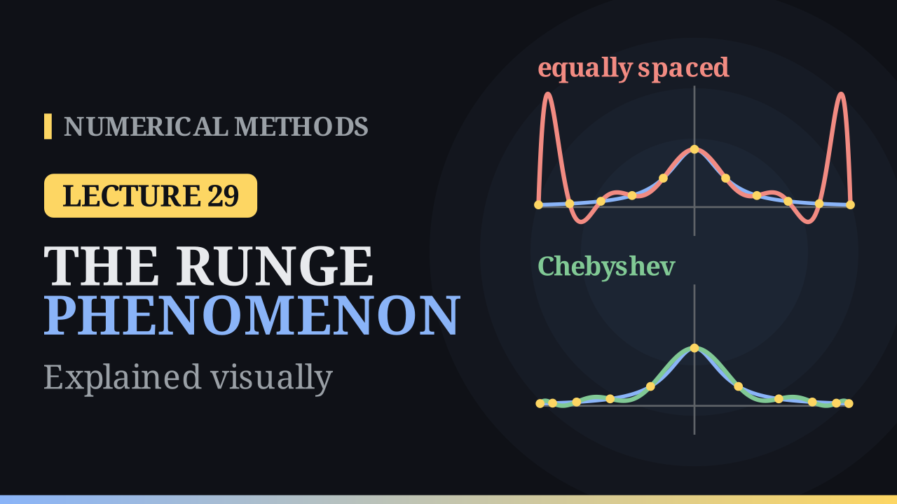

Lecture 29

# The Runge Phenomenon

{ .nm-video }

[Practise this lecture](../practice/lec29_runge.html){ .md-button .md-button--primary }

#### Key results
- Interpolating Runge's function \(f(x)=\frac{1}{1+25x^2}\) on \([-1,1]\) at **equally spaced** nodes, the polynomial swings wildly near \(x=\pm1\) and the maximum error **grows** with \(n\): \(0.44\) for \(n=4\), \(1.92\) for \(n=10\), \(59.8\) for \(n=20\).
- The bound \(\max|f-p_n|\le\frac{\max|f^{(n+1)}|}{(n+1)!}\max|w(x)|\), \(w(x)=\prod_{i=0}^{n}(x-x_i)\), explains it: the first factor grows like \(5^{n+1}\), and for equispaced nodes \(|w|\) is much larger near the ends.
- **Chebyshev nodes** \(x_i=\cos\frac{(2i+1)\pi}{2n+2}\) give \(w(x)=2^{-n}T_{n+1}(x)\) and \(\max|w|=2^{-n}\), the smallest possible; the Chebyshev interpolants of Runge's function converge.
- With equally spaced data that cannot be moved, use piecewise low-degree interpolation instead of one high-degree polynomial.

## More nodes, worse fit

For a gentle function such as \(e^x\), more equally spaced nodes do help: on \([-1,1]\) the maximum error is about \(1.1\times10^{-3}\) with \(5\) nodes and \(2.4\times10^{-10}\) with \(11\). Runge's function

\[
f(x)=\frac{1}{1+25x^2},\qquad x\in[-1,1],
\]

is just as smooth (it has derivatives of every order), yet its equispaced interpolants get worse as \(n\) grows. For \(n=10\) the fit is good in the middle (error below \(0.12\) for \(|x|\le0.6\)), but at \(x\approx-0.94\), where \(f\approx0.04\), the polynomial reaches \(p_{10}\approx1.96\). From \(n=8\) on, the maximum error roughly doubles every time two nodes are added.

## Why equispaced nodes fail

By the interpolation error theorem of the previous lecture,

\[
\max_{[-1,1]}|f-p_n|\le\frac{\max_{[-1,1]}|f^{(n+1)}|}{(n+1)!}\,\max_{[-1,1]}|w(x)|,\qquad w(x)=\prod_{i=0}^{n}(x-x_i).
\]

For Runge's function \(\max|f^{(n+1)}|/(n+1)!\) grows like \(5^{n+1}\): it is about \(2.6\times10^{3}\) for \(n=4\), \(4.4\times10^{7}\) for \(n=10\) and \(4.5\times10^{14}\) for \(n=20\). The second factor depends only on the nodes. For \(11\) equally spaced nodes, \(|w(0.1)|\approx9.8\times10^{-5}\) but \(|w(0.9)|\approx6.5\times10^{-3}\), \(67\) times larger: from a point near the end, the nodes on the far side are almost \(2\) units away. The maximum, \(\max|w|\approx8.5\times10^{-3}\), shrinks too slowly to beat \(5^{n+1}\), so the bound grows. The function cannot be changed, but the nodes can: the Runge phenomenon is the nodes' fault.

## Chebyshev nodes

Choose the nodes that make \(\max|w|\) as small as possible:

\[
x_i=\cos\!\left(\frac{(2i+1)\pi}{2n+2}\right),\qquad i=0,1,\dots,n .
\]

They are the shadows on the \(x\)-axis of \(n+1\) points spaced at equal angles on a semicircle, so they crowd towards \(\pm1\). They are the zeros of \(T_{n+1}(x)=\cos\big((n+1)\arccos x\big)\), whose leading coefficient is \(2^n\), so

\[
w(x)=2^{-n}\,T_{n+1}(x),\qquad \max_{[-1,1]}|w(x)|=2^{-n},
\]

the smallest value possible for \(n+1\) nodes. For \(n=10\): \(2^{-10}\approx9.8\times10^{-4}\) against \(8.5\times10^{-3}\) for equispaced nodes. For three nodes, \(x_i=0.866,\ 0,\ -0.866\). On \([a,b]\) use \(\frac{a+b}{2}+\frac{b-a}{2}x_i\); on \([0,2]\) this gives \(1.866,\ 1,\ 0.134\).

| \(n\) | 4 | 8 | 12 | 16 | 20 |
|---|---:|---:|---:|---:|---:|
| equispaced \(\max\lvert f-p_n\rvert\) | 0.44 | 1.05 | 3.66 | 14.4 | 59.8 |
| Chebyshev \(\max\lvert f-p_n\rvert\) | 0.402 | 0.171 | 0.069 | 0.033 | 0.015 |

The Chebyshev error keeps falling, to about \(2\times10^{-9}\) at \(n=100\). (The simple bound with \(2^{-n}\) is too crude to prove this for Runge's function; a deeper theorem guarantees convergence for smooth functions.)

## Equally spaced data

When the data come at fixed, equally spaced points, use low-degree pieces between neighbouring nodes rather than one high-degree polynomial. On the same \(11\) equispaced nodes, piecewise linear interpolation of Runge's function has maximum error \(0.067\), against \(1.92\) for \(p_{10}\).

[Practise this lecture](../practice/lec29_runge.html){ .md-button .md-button--primary }
[← Previous: The Interpolation Error](lec28-interpolation-error.md){ .md-button }

