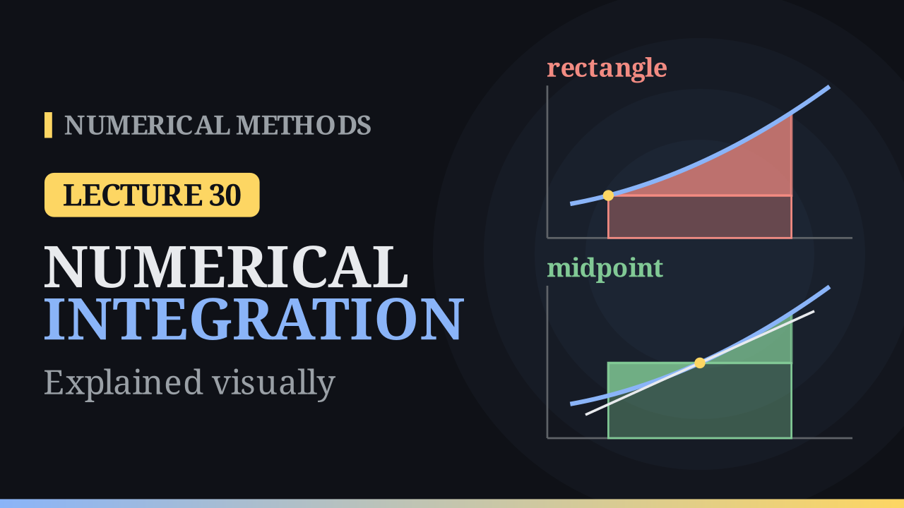

Lecture 30

# Introduction to Numerical Integration

{ .nm-video }

[Practise this lecture](../practice/lec30_integration_intro.html){ .md-button .md-button--primary }

#### Key results
- A **quadrature rule** replaces \(\int_a^b f(x)\,dx\) by a weighted sum \(\sum_{i=0}^{n}a_i f(x_i)\). Integrating the interpolant \(P_n=\sum f(x_i)\,\ell_i\) gives the weights \(a_i=\int_a^b\ell_i(x)\,dx\).
- **Degree of precision** \(n\): the rule is exact for every polynomial of degree at most \(n\), but not for some polynomial of degree \(n+1\).
- **Rectangle rule** \((b-a)\,f(a)\): error \(\frac{h^2}{2}f'(c)\), degree of precision \(0\). **Midpoint rule** \((b-a)\,f\!\left(\frac{a+b}{2}\right)\): error \(\frac{h^3}{24}f''(c)\), degree of precision \(1\) (here \(h=b-a\)).
- For \(\int_0^1\frac{dx}{1+x^2}=\frac{\pi}{4}\approx0.785398\): rectangle \(1\) (error \(0.2146\)), midpoint \(0.8\) (error \(0.0146\)). The composite rules have errors of order \(h\) and \(h^2\).

## Why numerical integration?

Many integrals have no antiderivative in terms of elementary functions, for example \(\int_0^1e^{-x^2}\,dx\approx0.7468\). In other problems \(f\) is only known at sample points, such as a velocity measured every few seconds, whose integral is the distance travelled. A computer can only evaluate \(f\) at finitely many points, so we approximate

\[
I=\int_a^b f(x)\,dx\approx\sum_{i=0}^{n}a_i\,f(x_i),
\]

with nodes \(x_i\in[a,b]\) and weights \(a_i\) fixed in advance. This is **numerical quadrature**.

## Quadrature based on interpolation

Choose distinct nodes \(x_0,\dots,x_n\) in \([a,b]\) and interpolate: \(P_n(x)=\sum_{i=0}^{n}f(x_i)\,\ell_i(x)\). Then

\[
\int_a^b f(x)\,dx\approx\int_a^b P_n(x)\,dx=\sum_{i=0}^{n}f(x_i)\int_a^b\ell_i(x)\,dx,\qquad a_i=\int_a^b\ell_i(x)\,dx .
\]

Integrating the interpolation error gives the quadrature error \(E(f)=\frac{1}{(n+1)!}\int_a^b f^{(n+1)}(\xi_x)\,w(x)\,dx\). To evaluate such integrals we use the **Weighted Mean Value Theorem**: if \(f\) is continuous and \(g\) is integrable and of one sign on \([a,b]\), then \(\int_a^b f(x)g(x)\,dx=f(c)\int_a^b g(x)\,dx\) for some \(c\in[a,b]\).

A rule has **degree of precision** \(n\) when it integrates every polynomial of degree \(\le n\) exactly but fails for some polynomial of degree \(n+1\). Since the rule and the integral are both linear in \(f\), it is enough to test \(1,x,x^2,\dots\) until the first failure.

## The rectangle rule

Interpolate by the constant \(P_0(x)=f(a)\):

\[
\int_a^b f(x)\,dx\approx(b-a)\,f(a).
\]

The error is \(E(f)=\int_a^b f'(\xi_x)(x-a)\,dx\). The weight \(x-a\) is never negative on \([a,b]\), so with \(h=b-a\)

\[
\int_a^b f(x)\,dx=h\,f(a)+\frac{h^2}{2}\,f'(c).
\]

The rule is exact for constants but gives \(0\) instead of \(\frac{h^2}{2}\) for \(f(x)=x\) on \([0,h]\): degree of precision \(0\).

## The midpoint rule

Interpolate by the constant \(f(m)\) at the centre \(m=\frac{a+b}{2}\):

\[
\int_a^b f(x)\,dx\approx(b-a)\,f(m).
\]

On one side of \(m\) the rectangle cuts off area, on the other it adds area, and the two errors partly cancel. A picture shows why: the trapezoid under the **tangent line** at \(m\) has average height \(f(m)\), so it has exactly the same area as the midpoint rectangle. The error is only the gap between the curve and its tangent. Formally, by Taylor's theorem about \(m\),

\[
f(x)=f(m)+f'(m)(x-m)+\frac{f''(\xi_x)}{2}(x-m)^2,
\]

and \(\int_a^b(x-m)\,dx=0\), so with the weight \((x-m)^2\ge0\)

\[
\int_a^b f(x)\,dx=h\,f(m)+\frac{h^3}{24}\,f''(c).
\]

The midpoint rule is exact for \(1\) and \(x\) (on \([0,1]\) it gives \(\frac12\) for \(x\)), but gives \(\frac14\) instead of \(\frac13\) for \(x^2\): degree of precision \(1\).

## Worked example

For \(I=\int_0^1\frac{dx}{1+x^2}=\frac{\pi}{4}\approx0.785398\), the rectangle rule gives \(f(0)=1\) (error \(0.2146\)) and the midpoint rule gives \(f(\tfrac12)=0.8\) (error \(0.0146\)), fifteen times smaller for the same work. On \([0,1]\), \(\max|f'|\approx0.65\) (at \(x=1/\sqrt3\)) and \(\max|f''|=2\) (at \(x=0\)), so the error bounds are \(0.65/2\approx0.325\) and \(2/24\approx0.083\); both true errors lie inside.

## Composite rules

Split \([a,b]\) into \(n\) pieces of width \(h=\frac{b-a}{n}\), \(x_i=a+ih\), and apply the rule on each:

\[
R_n=h\sum_{i=0}^{n-1}f(x_i),\qquad M_n=h\sum_{i=0}^{n-1}f\!\left(x_i+\tfrac h2\right),
\]

\[
I-R_n=\frac{b-a}{2}\,h\,f'(c),\qquad I-M_n=\frac{b-a}{24}\,h^2f''(c).
\]

| \(n\) | 1 | 2 | 4 | 8 | 16 |
|---|---:|---:|---:|---:|---:|
| \(\lvert I-R_n\rvert\) | 0.2146 | 0.1146 | 0.0599 | 0.0306 | 0.0155 |
| \(\lvert I-M_n\rvert\) | 0.0146 | 0.0052 | 0.0013 | \(3.3\times10^{-4}\) | \(8.1\times10^{-5}\) |

Doubling \(n\) halves the rectangle error and divides the midpoint error by \(4\): on a log–log plot the slopes are \(-1\) and \(-2\). For an error of at most \(10^{-6}\) the bounds ask for \(n\ge289\) midpoints but about \(325\,000\) rectangles.

## Cautions

- A rule only sees its samples. For \(\int_0^1(1+\cos8\pi x)\,dx=1\), every midpoint of \(M_4\) lands where \(f=0\) and every left end of \(R_4\) where \(f=2\): \(M_4=0\), \(R_4=2\).
- The error terms need bounded derivatives. For \(\int_0^1\frac{dx}{\sqrt x}=2\) the rectangle rule cannot even evaluate \(f(0)\); the midpoint rule works, but the error only halves when \(n\) is multiplied by \(4\) (\(0.301,\ 0.151,\ 0.076\) for \(n=4,16,64\)).
- The Weighted Mean Value Theorem needs a weight of one sign; otherwise the error must be found another way.

## Algorithm (composite midpoint rule)

1. \(h=(b-a)/n\), \(\text{sum}=0\).
2. For \(i=0,\dots,n-1\): add \(f\big(a+(i+\tfrac12)h\big)\) to the sum.
3. Return \(h\cdot\text{sum}\).

It uses \(n\) function values, the same as the composite rectangle rule. Next lecture: interpolating linearly through both end points gives the trapezoidal rule.

[Practise this lecture](../practice/lec30_integration_intro.html){ .md-button .md-button--primary }
[← Previous: The Runge Phenomenon](lec29-runge.md){ .md-button }

